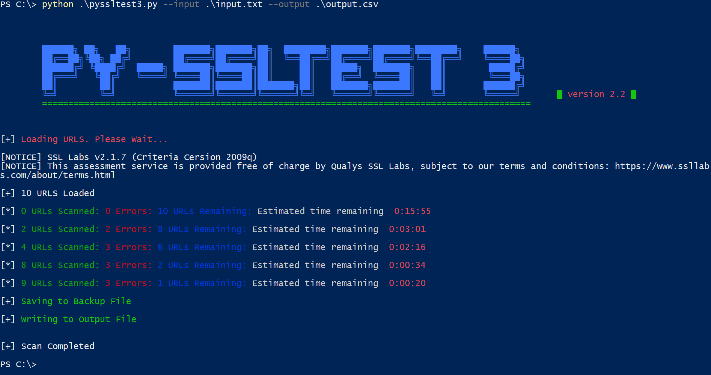

# PySSLTest3
 A threaded python script that can be used to run SSL test on a large number of applications using the Qulays SSL Lab API

## Setup
*	Requires python3
*	Install dependencies mentioned in `requirements.txt.`
    ```
    >pip install -r .\requirements.txt
    ```
*   Run the script using
```
>python pyssltest3.py --input INPUTFILE.txt --output OUTPUTFILE.csv
```


## Features
*  Threaded
*  Backups up the output and can be recovered if the script is stopped in between
*  Pauses automatically if the internet connection is lost
*  Displays update every 60 seconds

## Help
```
usage: pyssltest3.py [-h] -i INPUT -o OUTPUT [-c] [-b HEARTBEAT] [-w WRITE][-t THREADS] [-v] [-d]

required arguments:
  -i INPUT, --input INPUT		The input file with list of URLs
  -o OUTPUT, --output OUTPUT            Output csv file

optional arguments:
  -h, --help		show this help message and exit
  -c, --cache		Use Cached Data from SSL LAB
  -b  --heartbeat	Interval between status report displayed on the screen
  -w  --write		Application Number Threshold to backup to file
  -t  --threads		Set the number of threads
  -v 			Verbose Logging level:INFO
  -d			Verbose Logging level:DEBUG
```

## Notes

*   The script debug log is written to `pyssltest3_log.txt`. This can be used for debugging.
*   The estimated time remaining might fluctuate depending of the response time from the SSL Lab api. It might not be very accurate for a small number of applications.
*   No validity checks are done on input URLs.
*   The default number of threads is 8. This value was kept as I observed that this configuration gives the optimum performance. SSL Labs provide 25 tests concurrently and then a timeout 1000 seconds is enforced once the test is complete. However the enforced time seems to be different that 1000 seconds. Using 8 threads makes sure that we have maximum performance by using all the threads without sending too many requests.